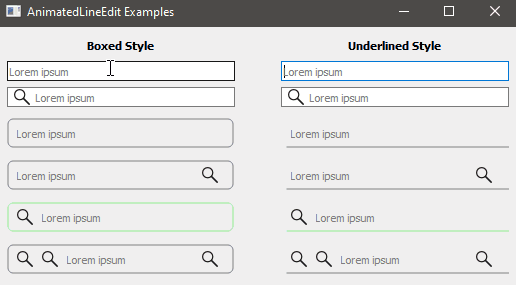

# AnimatedLineEdit

This is an extended version of the QLineEdit to enable a animation of the placeholder text.

Improvements and commtens are very welcome :)

### Functions / API

These are the main functions:

- set border-radius
- set focus border color
- set non focus border color
- add leading and trailing buttons inside the QLineEdit (similar to the QActions but QActions aren't centered cause we use a margin at the top)

### Usage

Copy the `AnimatedLineEdit` subdirectory into your project folder and add this to your qmake project file:

```cmake
include(AnimatedLineEdit/AnimatedLineEdit.pri)
```

### Example

Some different normal and AnimatedLineEdits:


